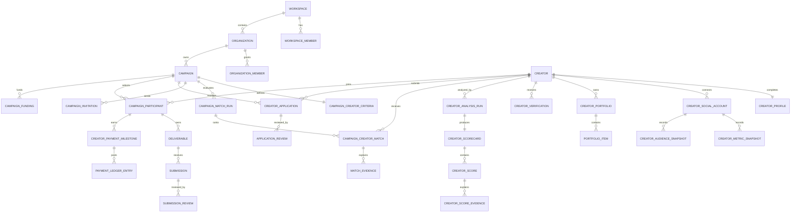

# PRIFYN Creator Intelligence — Product & Technical Blueprint

Status: **Review required before implementation**  
Scope: Brand workspace + creator portal + AI-assisted matching and collaboration  
Product position: A creator relationship and campaign operating system—not an open creator marketplace.

## Product decisions

1. PRIFYN owns the creator record, campaign workflow, evidence, and collaboration history.
2. Public campaign discovery is optional. The MVP prioritizes search, shortlist, invite, and controlled applications.
3. AI recommends and explains; humans verify, shortlist, approve, reject, and release payments.
4. A creator is a reusable workspace relationship, not a disposable campaign participant.
5. Existing Workspace, Organization, Campaign, Creator, Deliverable, Submission, Attribution, and AI Evidence entities remain authoritative. The module extends them instead of creating duplicate silos.
6. Agencies can manage multiple brand organizations inside one workspace with organization-scoped permissions.

---

## 1. User journeys

### Brand journey

`Invite team → Define campaign → Discover creators → Review AI Interview Summary + fit → Shortlist/compare → Invite or review applications → Agree terms → Track content → Review/revise → Approve → Release payment → Review performance → Rebook`

Decision points:

- Is the creator relevant to this campaign, and why?
- Is the evidence complete and fresh enough to trust?
- What risks require human review?
- Who owns the next action and when is it due?
- Should the brand rebook this creator?

### Creator journey

`Sign up → Build profile → Connect or add social accounts → Add portfolio → Complete verification → Receive recommendations/invites → Apply → Agree terms → Submit work → Handle revisions → Publish → Receive payment → Review performance and improvements`

Progressive onboarding:

1. Identity: name, username, location, languages, bio.
2. Positioning: category, niches, experience, collaboration preferences.
3. Proof: social accounts, metrics, audience, portfolio, previous collaborations.
4. Commercial readiness: rate card, availability, verification and payout readiness.
5. Intelligence: AI summary, scores, evidence gaps, and improvement suggestions.

### Campaign lifecycle

`Draft → Recruiting → Selection → Contracting → In progress → Content review → Scheduled → Published → Measuring → Completed`

Applications use their own lifecycle:

`Draft → Submitted → Screening → Shortlisted → Interview/clarification → Offered → Accepted | Rejected | Withdrawn`

### AI Interview Summary

When creators apply, the brand should not be forced to open dozens of TikTok/Instagram links first. PRIFYN should generate a recruiter-style summary for each applicant.

Required fields:

- Creator summary
- Campaign match score
- Why this creator fits
- Potential risks
- Evidence used
- Confidence
- Recommended next action

Example:

`Sarah Foodie — Match 94%. Food creator in Surabaya focused on restaurant and cafe reviews. Engagement is stable at 6.8%, style is natural and educational, and prior F&B campaign history is relevant. Strongest signal is storytelling and viewer retention. Main risk is posting consistency. Recommendation: shortlist and confirm publish schedule.`

Explainability requirements:

- Scores must never be black-box.
- Every recommendation must show evidence and confidence.
- Risks should be visible before shortlist/approval.
- Missing evidence should reduce confidence rather than fabricate certainty.

---

## 2. Information architecture

### Brand workspace

- Home
  - Decisions requiring attention
  - Recruiting funnel
  - Deliverables at risk
  - Payment approvals
- Creators
  - Search and filters
  - Saved talent pools
  - Compare creators
  - Creator profile and evidence
- Campaigns
  - Campaign brief
  - Creator criteria
  - Pipeline board
  - Applications and invitations
  - Deliverables and approvals
  - Payments
  - Performance
- Messages
- Reports
- Settings
  - Brand profile
  - Team members
  - Roles and permissions
  - Integrations
  - AI and data controls

### Creator portal

- Home
  - Profile completion
  - Invites and open tasks
  - Recommended campaigns
  - Earnings summary
- Profile
- Portfolio
- Opportunities
- Applications
- Active campaigns
  - Brief and contract
  - Workroom
  - Submissions and revisions
  - Publish schedule
- Payments
- Performance
- AI suggestions
- Settings and connected accounts

### Platform administration

- Creator verification queue
- Brand/workspace review
- Safety and dispute queue
- AI policy and score versions
- Taxonomy management
- Audit trail

---

## 3. Database schema

### Existing entities to keep

- `workspaces`, `workspace_members`, `workspace_invitations`
- `organizations`, `organization_members`
- `campaigns`, `campaign_briefs`, `campaign_objectives`
- `creators`, `creator_channels`, `creator_assessments`, `creator_verifications`
- `campaign_participants`, `deliverables`, `submissions`, `submission_reviews`
- `rewards`, `payment_status_records`
- `performance_facts`, `conversion_events`, `attribution_runs`, `attribution_results`
- `insight_runs`, `insights`, `insight_evidence`, `recommended_actions`
- `activities`, `audit_events`, `outbox_events`

### Creator profile extensions

| Entity | Purpose | Important fields |
|---|---|---|
| `creator_profiles` | Rich creator identity and preferences | creator_id, username, location, languages[], bio, category, niches[], experience, collaboration_types[], availability_status, rate_visibility |
| `creator_social_accounts` | Authorized or manually declared social accounts | creator_id, platform, handle, url, external_account_id, connection_status, verification_status, token_ref |
| `creator_metric_snapshots` | Time-versioned social performance | social_account_id, observed_at, followers, avg_views, avg_engagement, posting_frequency, source, freshness |
| `creator_audience_snapshots` | Aggregated audience data | social_account_id, observed_at, country_breakdown, age_breakdown, gender_breakdown, sample_size, source |
| `creator_portfolios` | Portfolio collections | creator_id, title, summary, visibility |
| `portfolio_items` | Video, image, link, result, testimonial | portfolio_id, type, asset_url, public_url, caption, brand_name, campaign_result, consent_status |
| `creator_collaboration_history` | Previous brand proof | creator_id, brand_name, campaign_id?, role, deliverables, result_summary, verified_at |
| `creator_documents` | Verification metadata only | creator_id, type, storage_key, review_status, expires_at; raw documents remain private storage objects |

### Intelligence and matching

| Entity | Purpose | Important fields |
|---|---|---|
| `creator_analysis_runs` | Versioned AI analysis job | creator_id, input_cutoff, model, prompt_version, policy_version, status |
| `creator_scorecards` | Summary for one analysis version | analysis_run_id, summary, suitable_for[], overall_confidence, limitations[] |
| `creator_scores` | Explainable dimension score | scorecard_id, dimension, score, reason, confidence, improvement_suggestions[] |
| `creator_score_evidence` | Source-level provenance | score_id, evidence_type, source_reference, excerpt_hash, observed_at |
| `campaign_match_runs` | Versioned matching execution | campaign_id, criteria_version, input_cutoff, status |
| `campaign_creator_matches` | Match result | match_run_id, creator_id, score, reasons[], strengths[], weaknesses[], estimated_performance, confidence, recommendation |
| `match_evidence` | Evidence behind a match | match_id, source_type, source_id, label, value, freshness |

### Recruiting and collaboration

| Entity | Purpose | Important fields |
|---|---|---|
| `campaign_creator_criteria` | Search/matching requirements | campaign_id, locations[], niches[], platforms[], content_types[], follower_range, budget_range, creators_needed, deadline |
| `talent_pools` | Reusable brand shortlists | organization_id, name, owner_user_id |
| `talent_pool_members` | Creators saved to pools | talent_pool_id, creator_id, note, added_by |
| `campaign_invitations` | Direct creator recruitment | campaign_id, creator_id, status, message, expires_at |
| `creator_applications` | Creator application record | campaign_id, creator_id, status, proposal, proposed_rate_minor, submitted_at |
| `application_answers` | Campaign-specific questions | application_id, question_id, answer_text, asset_key |
| `application_reviews` | Hiring-style evaluation | application_id, reviewer_id, decision, scorecard, note |
| `conversations` / `messages` | Contextual collaboration | organization_id, campaign_id?, participant identities, sender, body, attachments, read_at |
| `campaign_agreements` | Commercial terms and consent | participant_id, version, terms, status, accepted_at |

### Payment controls

| Entity | Purpose | Important fields |
|---|---|---|
| `campaign_funding` | Campaign funding/hold state | campaign_id, provider, provider_reference, amount_minor, status |
| `creator_payment_milestones` | Amount unlocked by approval | participant_id, deliverable_id?, amount_minor, release_condition, status |
| `creator_payout_accounts` | Provider reference; no raw bank details | creator_id, provider, external_account_ref, verification_status |
| `payment_ledger_entries` | Immutable money trail | workspace_id, participant_id, type, amount_minor, currency, provider_reference, occurred_at |

### Required constraints

- Every tenant-owned row carries `workspace_id`; brand-specific rows also carry `organization_id` where relevant.
- Social handles are unique by workspace + platform + handle.
- AI scores are immutable per analysis version.
- A score cannot exist without evidence or an explicit `evidence_unavailable` limitation.
- Revision count is capped by the campaign agreement or brief policy.
- Payment release requires approved deliverables and an authorized finance action.
- Documents, OAuth tokens, and payout details use opaque secure references—not plaintext database fields.

---

## 4. ERD



---

## 5. API design

### API conventions

- Versioned endpoints under `/api/v1`.
- Workspace and organization scope resolved server-side from the authenticated membership; never trusted from client input alone.
- Cursor pagination for creator search, applications, messages, and audit events.
- Idempotency keys for invitations, application submission, publishing, and payment actions.
- Optimistic concurrency/version fields for briefs, agreements, and reviews.
- Signed upload URLs for media and private documents.
- Long-running AI analysis and social sync use jobs plus status endpoints.

### Creator APIs

```text
GET    /api/v1/creators
POST   /api/v1/creators
GET    /api/v1/creators/:creatorId
PATCH  /api/v1/creators/:creatorId/profile
POST   /api/v1/creators/:creatorId/social-accounts/:platform/connect
POST   /api/v1/creators/:creatorId/portfolio/items
POST   /api/v1/creators/:creatorId/verification-requests
POST   /api/v1/creators/:creatorId/analysis-runs
GET    /api/v1/creators/:creatorId/scorecard
GET    /api/v1/creators/:creatorId/evidence
```

### Recruiting APIs

```text
PUT    /api/v1/campaigns/:campaignId/creator-criteria
POST   /api/v1/campaigns/:campaignId/match-runs
GET    /api/v1/campaigns/:campaignId/matches
POST   /api/v1/campaigns/:campaignId/invitations
POST   /api/v1/campaigns/:campaignId/applications
PATCH  /api/v1/applications/:applicationId/status
POST   /api/v1/applications/:applicationId/reviews
POST   /api/v1/talent-pools/:poolId/creators
```

### Collaboration APIs

```text
GET    /api/v1/campaigns/:campaignId/workroom
POST   /api/v1/deliverables/:deliverableId/submissions
POST   /api/v1/submissions/:submissionId/reviews
POST   /api/v1/deliverables/:deliverableId/schedule
POST   /api/v1/conversations/:conversationId/messages
```

### Payment APIs

```text
POST   /api/v1/campaigns/:campaignId/funding-intents
POST   /api/v1/payment-milestones/:milestoneId/approve
POST   /api/v1/payment-milestones/:milestoneId/release
GET    /api/v1/creators/me/earnings
POST   /api/v1/webhooks/payments/:provider
```

### AI response contract

```json
{
  "score": 96,
  "reason": "Strong food niche and Jakarta audience alignment.",
  "strengths": ["Natural product integration", "Relevant campaign history"],
  "risks": ["Posting consistency declined in the last 30 days"],
  "estimatedPerformance": { "views": { "min": 85000, "max": 125000 } },
  "confidence": 0.91,
  "evidence": [{ "source": "portfolio_item", "observedAt": "2026-08-01T00:00:00Z" }],
  "limitations": ["Instagram audience demographics were last refreshed 45 days ago"],
  "recommendedAction": "Invite for a paid TikTok campaign"
}
```

### Domain events

```text
creator.profile_completed
creator.social_connected
creator.analysis_completed
campaign.matching_completed
application.submitted
application.status_changed
submission.received
submission.revision_requested
deliverable.approved
content.published
payment.release_requested
payment.paid
```

---

## 6. Permission matrix

| Capability | Workspace Owner | Org Admin | Campaign Manager | Reviewer | Finance | Analyst | Creator |
|---|:---:|:---:|:---:|:---:|:---:|:---:|:---:|
| Manage workspace members | ✓ | — | — | — | — | — | — |
| Manage brand/company members | ✓ | ✓ | — | — | — | — | — |
| Assign organization roles | ✓ | ✓ | — | — | — | — | — |
| Create/edit campaigns | ✓ | ✓ | ✓ | View | View | View | — |
| Search and shortlist creators | ✓ | ✓ | ✓ | ✓ | View | View | — |
| Invite/reject/approve creators | ✓ | ✓ | ✓ | Recommend | — | — | — |
| View private creator documents | Restricted | Restricted | — | — | — | — | Own only |
| Review submissions | ✓ | ✓ | ✓ | ✓ | — | View | Own status |
| Approve commercial terms | ✓ | ✓ | Configurable | — | ✓ | — | Accept own |
| Release payments | ✓ | Configurable | — | — | ✓ | — | — |
| View campaign financials | ✓ | ✓ | Configurable | — | ✓ | ✓ | Own only |
| View AI evidence | ✓ | ✓ | ✓ | ✓ | Relevant | ✓ | Own scorecard |
| Edit creator profile | — | — | — | — | — | — | Own only |
| Apply to campaigns | — | — | — | — | — | — | ✓ |

Company/team management is therefore a first-class capability: owners and organization admins can invite users, remove access, assign roles, limit users to selected brands, and review an audit log. Agencies can keep each client brand isolated while sharing approved agency staff across organizations.

---

## 7. Wireframes

### Brand creator search

```text
┌──────────────────────────────────────────────────────────────────────┐
│ Creators                         [Saved talent] [Invite creator]     │
│ Search creators, niches, location…                                  │
├──────────────┬───────────────────────────────────────┬───────────────┤
│ Filters      │ Creator results                       │ Shortlist     │
│ Platform     │ [Avatar] Nabila Putri       Fit 96%  │ 3 selected    │
│ Niche        │ Food · Jakarta · TikTok              │ Compare       │
│ Location     │ Why: audience + storytelling         │ Invite        │
│ Audience     │ Evidence current 3d ago               │ Save as pool  │
│ Budget       │ [View profile] [Shortlist]            │               │
│ Availability │                                       │               │
└──────────────┴───────────────────────────────────────┴───────────────┘
```

### Creator profile

```text
┌──────────────────────────────────────────────────────────────────────┐
│ Nabila Putri   Verified   Available             [Invite] [Compare]  │
│ Food creator · Jakarta · Bahasa Indonesia                            │
├───────────────────────────────┬──────────────────────────────────────┤
│ AI summary                    │ Campaign fit                         │
│ Natural product integration   │ Ramadan Made Simple          96%   │
│ Strong food storytelling      │ 4 strengths · 1 risk               │
│ Confidence 94%                │ [View evidence]                     │
├───────────────────────────────┴──────────────────────────────────────┤
│ Overview | Portfolio | Audience | Performance | Reviews | History   │
│ [Portfolio cards / evidence / time-series metrics]                  │
└──────────────────────────────────────────────────────────────────────┘
```

### Recruiting pipeline

```text
┌──────────────────────────────────────────────────────────────────────┐
│ Ramadan Made Simple                         8 of 12 creators selected│
├──────────────┬──────────────┬──────────────┬──────────────┬──────────┤
│ Applied      │ Screening    │ Shortlisted  │ Offered      │ Accepted │
│ Sarah 82%    │ Dimas 76%    │ Nabila 96%   │ Ardian 89%   │ Maya 91% │
│ [cards]      │ [cards]      │ [cards]      │ [cards]      │ [cards]  │
└──────────────┴──────────────┴──────────────┴──────────────┴──────────┘
```

### Creator dashboard

```text
┌──────────────────────────────────────────────────────────────────────┐
│ Good morning, Nabila                       Profile strength: 86%    │
├───────────────────────────────┬──────────────────────────────────────┤
│ Next actions                  │ Recommended campaigns               │
│ Submit TikTok draft · Today   │ Family Feast · Match 94%            │
│ Confirm publish time · Fri    │ New Product Launch · Match 87%      │
├───────────────────────────────┼──────────────────────────────────────┤
│ Earnings                      │ AI improvement suggestion           │
│ Rp 18.4m approved             │ Add 2 recent campaign results       │
│ Rp 6.2m pending               │ Why this improves brand confidence  │
└───────────────────────────────┴──────────────────────────────────────┘
```

---

## 8. UI components

### Shared foundation

- App shell, command search, organization switcher, language switcher
- Role-aware navigation and guarded actions
- Data freshness indicator
- Confidence badge and evidence drawer
- Empty, loading, partial-data, error, and permission-denied states
- Activity timeline and audit entry

### Creator discovery

- Creator search input with saved searches
- Filter rail and removable filter chips
- Creator result card and compact list row
- Shortlist tray
- Side-by-side comparison table
- Talent pool picker

### Creator intelligence

- Creator identity header
- Social account badge and connection state
- Portfolio gallery/media viewer
- Audience composition card
- Performance trend chart
- AI summary card
- Score radar/list with reason, confidence, and improvement suggestion
- Brand safety finding with severity and evidence
- Evidence drawer with source and freshness

### Recruiting

- Campaign criteria builder
- Match result card
- Application form builder
- Application detail drawer
- Recruiting pipeline board
- Structured reviewer scorecard
- Invite composer and bulk invite review

### Collaboration and money

- Campaign workroom
- Deliverable checklist
- Media submission viewer
- Timestamped feedback/revision panel
- Approval control with irreversible-action confirmation
- Publish scheduler
- Funding status and payment milestone timeline
- Earnings and payout status card

---

## 9. Dashboard layouts

### Brand dashboard

Primary question: **Which creator or campaign decision needs attention today?**

1. Decision inbox: applicants to review, expired invitations, late deliverables, payment approvals.
2. Recruiting health: needed vs selected creators and bottleneck stage.
3. Campaign risk: delivery, brand safety, budget, and publishing risks.
4. Creator performance: best creator, performance change, and rebooking recommendation.
5. AI recommendation: why, evidence, confidence, limitation, action owner.

### Creator dashboard

Primary question: **What should I do next to win and complete more suitable campaigns?**

1. Next actions and deadlines.
2. Recommended opportunities with match reasoning.
3. Application status funnel.
4. Active campaign workroom shortcuts.
5. Approved, pending, and paid earnings.
6. Profile and content improvement recommendations.

### Agency dashboard

Primary question: **Which client and campaign needs intervention?**

1. Cross-brand risk summary.
2. Recruiting capacity and response rate.
3. Deliverable approval workload.
4. Upcoming publish calendar.
5. Budget and payment exposure by organization.

---

## 10. Development roadmap

### Phase 0 — Foundation and validation

- Validate terminology and workflows with 5–8 brands/agencies and 8–12 creators.
- Finalize creator, campaign, application, and evidence taxonomies.
- Confirm verification/legal requirements and payment-provider constraints.
- Define baseline matching metrics and human-review rubric.

### Phase 1 — Creator CRM (MVP-A)

- Creator/brand account modes and role-aware onboarding.
- Company team management and organization-scoped permissions.
- Creator profile, social links, manual metrics, portfolio, availability, rate card.
- Brand creator directory, search, filters, talent pools, shortlist, compare.
- Manual verification queue.

Exit criterion: a brand can replace its creator spreadsheet and make a documented shortlist.

### Phase 2 — Recruiting workflow (MVP-B)

- Campaign creator criteria and controlled opportunity visibility.
- Invitations, applications, proposals, rates, questions, and portfolio attachments.
- ATS-style pipeline, reviewer scorecards, approval/rejection, activity history.
- Campaign participant conversion after acceptance.

Exit criterion: a campaign can recruit its required creators without leaving PRIFYN.

### Phase 3 — Collaboration workflow (MVP-C)

- Campaign workroom, deliverables, uploads/links, review, and revision cap.
- Publish schedule, manual publish confirmation, messaging, and notifications.
- Payment milestones and manual payment-status tracking.

Exit criterion: accepted creators can complete a campaign with an auditable trail.

### Phase 4 — Explainable intelligence

- Portfolio ingestion and evidence extraction.
- Creator summary and dimension scorecards.
- Campaign match ranking with reasons, risks, confidence, and limitations.
- Human feedback capture to calibrate ranking quality.
- Brand and creator improvement recommendations.

Exit criterion: screening time decreases while human acceptance quality does not decline.

### Phase 5 — Selective integrations and payments

- TikTok profile/video connection, YouTube analytics, approved Instagram access.
- Scheduled sync, freshness states, consent and revocation.
- Payment provider adapter, funding, approval-gated release, payout webhooks.
- Publishing adapters only where platform review and creator authorization permit.

Exit criterion: verified social evidence and payment status update without manual re-entry.

### Phase 6 — Reputation and prediction

- Cross-campaign reputation with dispute-aware signals.
- Performance forecasting and budget recommendations.
- Certifications, affiliate/referral workflows, and contract review.
- Public opportunity marketplace only if controlled discovery proves insufficient.

### Success metrics

- Median time from brief to approved shortlist.
- Percentage of suggested creators accepted by a human reviewer.
- Application-to-acceptance rate.
- On-time submission and publishing rate.
- Revision rounds per approved deliverable.
- Campaign ROAS and creator rebooking rate.
- Creator payout time after approval.
- AI recommendation evidence coverage and override rate.

---

## Integration map

### Recommended sequence

| Priority | Integration | Value | MVP approach |
|---|---|---|---|
| P0 | PRIFYN Campaigns and Reports | Shared brief, deliverables, attribution, creator history | Native bounded-context events |
| P0 | Google identity | Brand and creator authentication | Better Auth server flow; official Google-rendered or approved button asset |
| P0 | Object storage | Portfolio, submission, and private verification uploads | Signed uploads; private-by-default documents |
| P0 | Email notifications | Invites, deadlines, application and approval changes | Transactional adapter + outbox |
| P1 | TikTok | Profile and public video portfolio | Login Kit + Display API after app approval |
| P1 | YouTube | Channel/video metrics and audience insights | OAuth + Data/Analytics APIs with creator consent |
| P1 | Instagram/Facebook | Professional profile, media, and permitted insights | Approved Meta app and permission-scoped connector |
| P1 | Payment provider | Funding, approval-gated release, payout status | Provider adapter; validate Indonesian legal/commercial support before choosing |
| P2 | TikTok publishing | Approved content publishing | Content Posting API; creator authorization and app audit required |
| P2 | X | Profile/posts and permitted metrics | Pay-per-use connector; private metrics only for authorized owned posts |
| P2 | Calendar | Publish schedules and deadlines | Google/Outlook calendar adapter |
| P2 | WhatsApp/Slack | Operational notifications | Deep link first; official business/app integration later |
| P3 | Lemon8 | Portfolio and metrics | Manual public links until an approved partner interface is available |
| P3 | External creator databases | Supplemental sourcing | Adapter boundary; do not make MVP dependent on a partner |

Important: connector support must be represented as capability flags (`profile_read`, `portfolio_read`, `insights_read`, `comments_read`, `content_publish`) because each platform exposes different scopes and approval requirements.

## Google sign-in requirement

The current CSS-generated “G” is not acceptable for production. At implementation time:

1. Prefer the Google Identity Services-rendered button.
2. If the existing authentication flow needs a custom React button, use Google’s current pre-approved multicolor “G” asset without recoloring, stretching, or recreating it.
3. Use “Continue with Google” / “Lanjutkan dengan Google” and preserve the required padding, contrast, and boundary.
4. Authentication and YouTube/Google service permissions remain separate. Ask for YouTube scopes incrementally only when the creator connects YouTube.

## Integration evidence reviewed

- [Google Sign-in branding guidelines](https://developers.google.com/identity/branding-guidelines)
- [TikTok Display API](https://developers.tiktok.com/doc/display-api-overview/)
- [TikTok Content Posting API](https://developers.tiktok.com/doc/content-posting-api-get-started)
- [YouTube Analytics and Reporting APIs](https://developers.google.com/youtube/analytics)
- [X API metrics](https://docs.x.com/x-api/fundamentals/metrics)
- [Stripe Connect platform and marketplace model](https://docs.stripe.com/connect)

## Review decisions required before implementation

1. Are creators allowed to browse all open campaigns, or only public/invited opportunities?
2. Should creators belong to one personal account only, or can managers/agencies manage creator profiles?
3. Will PRIFYN hold funds, initiate payouts, or only track external payments in the first release?
4. Which verification documents are mandatory in Indonesia, and who may view them?
5. Should brand users see creator rate cards before invitation, after shortlist, or only after application?
